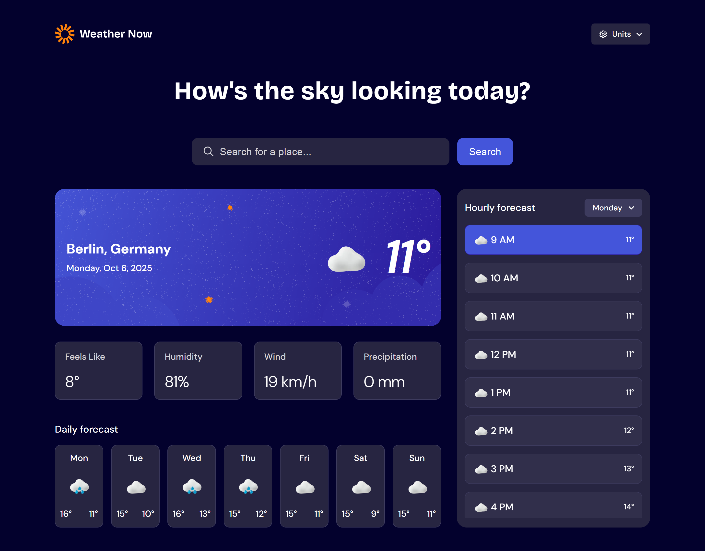

# Frontend Mentor - Weather App Solution

This is a solution to the [Weather app challenge on Frontend Mentor](https://www.frontendmentor.io/challenges/weather-app-K1FhddVm49).

**Hackathon period:** September 6, 2025 – October 6, 2025
**My development period:** September 21 – October 5, 2025 (2 weeks)

---

## Table of Contents

* [Overview](#overview)

  * [The Challenge](#the-challenge)
  * [Screenshots](#screenshots)
  * [Links](#links)
* [My Process](#my-process)

  * [Built With](#built-with)
  * [What I Learned](#what-i-learned)
  * [Continued Development](#continued-development)
  * [Useful Resources](#useful-resources)
* [Author](#author)

---

## Overview

### The Challenge

Users should be able to:

* Search for weather information by entering a location in the search bar (with autocomplete).
* Determine their current location and get the weather for it.
* View current weather conditions: temperature, weather icon, "feels like" temperature, humidity, wind speed, precipitation.
* See a 7-day forecast with daily max/min temperatures and weather icons.
* See an hourly forecast for a single day with average temperature and weather icon.
* Toggle between Imperial and Metric units (C/F, km/h, mph, mm, in).
* Navigate the UI on different devices (mobile-first, tablet, desktop).
* Use keyboard navigation with focus states, hover, and active states, including reduced motion preferences.

---

### Screenshots

---

### Links

* Solution URL: [GitHub Repository](https://github.com/lizakein/weather-app)
* Live Site URL: [Live Demo](https://lizakein.github.io/weather-app/)

---

## My Process

### Built With

* React + TypeScript
* Vite
* Semantic HTML5
* CSS Grid & Flexbox
* Mobile-first workflow
* Custom hooks: `useContextMenu`, `useGeolocation`, `useLocalStorage`, `useWeather`
* Skeleton loading for API fetches
* LocalStorage for user-selected units
* OpenMeteo API

---

### What I Learned

During this project, I deepened my understanding and practical skills in:

* Working with external APIs (OpenMeteo) and handling asynchronous data fetching.
* Implementing Skeleton loading states for better UX.
* Managing local storage for user preferences.
* Mobile-first responsive design, ensuring layouts for phones, tablets, and desktops matched Figma mockups.
* Building custom React hooks to encapsulate reusable logic.
* Managing keyboard navigation and accessibility (focus states, hover, active, and respecting reduced motion).
* TypeScript type safety with API data.

---

### Continued Development

Future improvements could include:

* Improved auto-detection of the current location with display of the actual place name.
* Favorites system to save and quickly access multiple locations.
* Comparing weather between different cities.
* Additional weather metrics: UV index, visibility, air pressure, sunrise/sunset times.
* Animated backgrounds reflecting the weather.
* Voice search for locations.
* Light theme with day/night adaptation.
* Smooth animations for transitions.

---

### Useful Resources

* [OpenMeteo API Documentation](https://open-meteo.com/) – for API integration.
* [React Documentation](https://reactjs.org/) – for React concepts and hooks.
* [TypeScript Documentation](https://www.typescriptlang.org/docs/) – for type safety and interfaces.

---

## Author

* GitHub - [@lizakein](https://github.com/lizakein)
* Frontend Mentor - [@lizakein](https://www.frontendmentor.io/profile/lizakein)

---

# 🇷🇺 Русская версия

## Обзор

### Задача

Пользователи должны иметь возможность:

* Искать погоду по названию города (с автодополнением).
* Определять своё текущее местоположение и получать погоду для него.
* Просматривать текущие погодные условия: температура, значок погоды, «ощущается как», влажность, скорость ветра, осадки.
* Просматривать прогноз на 7 дней с максимальными/минимальными температурами и значками погоды.
* Просматривать почасовой прогноз для одного дня с средней температурой и значком.
* Переключать единицы измерения (C/F, км/ч, mph, мм, дюймы).
* Использовать интерфейс на разных устройствах (mobile-first: телефон, планшет, компьютер).
* Навигация с клавиатуры с фокусом, hover и active, включая поддержку reduced motion.

---

### Скриншоты

---

### Ссылки

* Репозиторий: [GitHub Repository](https://github.com/lizakein/weather-app)
* Демо: [Live Demo](https://lizakein.github.io/weather-app/)

---

## Мой процесс

### Технологии

* React + TypeScript
* Vite
* Semantic HTML5
* CSS Grid & Flexbox
* Mobile-first workflow
* Кастомные хуки: `useContextMenu`, `useGeolocation`, `useLocalStorage`, `useWeather`
* Skeleton загрузка при получении данных с API
* LocalStorage для выбранных пользователем единиц измерения
* OpenMeteo API

---

### Чему я научилась

Во время работы над проектом я улучшила навыки:

* Работа с внешними API (OpenMeteo) и асинхронными запросами.
* Реализация Skeleton-загрузки для лучшего UX.
* Управление LocalStorage для хранения пользовательских настроек.
* Mobile-first адаптивная верстка, соответствие макетам Figma для телефонов, планшетов и компьютеров.
* Создание кастомных React-хуков для повторного использования логики.
* Поддержка клавиатурной навигации и доступности (фокус, hover, active, reduced motion).
* Использование TypeScript для типизации данных API.

---

### Дальнейшее развитие

Планы на будущее:

* Улучшение автоопределения текущего местоположения с отображением реального названия.
* Система избранных локаций для быстрого доступа к нескольким городам.
* Сравнение погоды между городами.
* Дополнительные показатели погоды: UV index, видимость, давление, рассвет/закат.
* Анимированные обои, отражающие погоду.
* Голосовой поиск локаций.
* Светлая тема с адаптацией под время суток.
* Плавные анимации при переходах.

---

### Полезные ресурсы

* [Документация OpenMeteo](https://open-meteo.com/) – для работы с API.
* [Документация React](https://reactjs.org/) – концепции и хуки React.
* [Документация TypeScript](https://www.typescriptlang.org/docs/) – для типизации и интерфейсов.

---

## Автор

* GitHub - [@lizakein](https://github.com/lizakein)
* Frontend Mentor - [@lizakein](https://www.frontendmentor.io/profile/lizakein)
